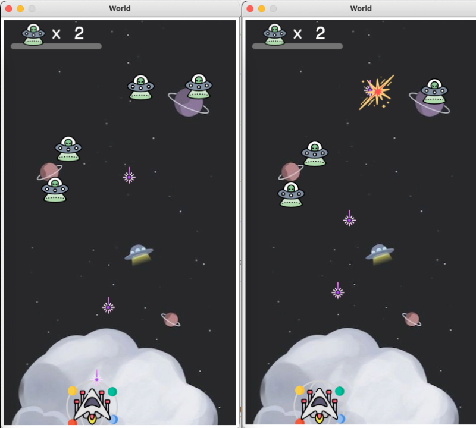
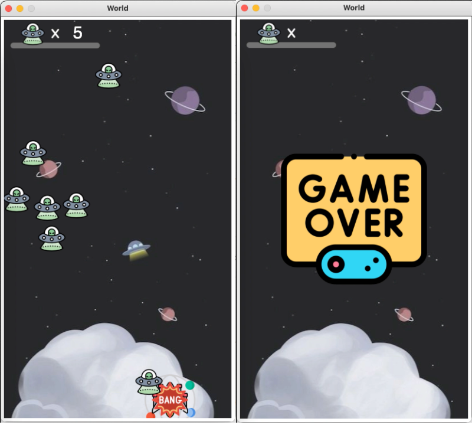

# Space Invaders Game

I developed this program from scratch based on all design patterns learned after completing a course in **Systematic Program Design** at UBC. That curriculum is based on [How to Design Programs](http://htdp.org/)

* By applying the fundamental approach in [How to Design World](https://world.cs.brown.edu/), I implemented cores features of the classic Space Invaders game and designed some new game assets (e.g. explosion when a missile hits an invader, scoreboard, pop-up animation when an invader hits a spaceship)
* My approach to this personal project used top-down systematic design and thorough **test-driven development** at every step. The code is entirely written in Racket's Intermediate Student, **a pure functional language**. It also uses the How to design world framework for interactive programs and basic animations.

# Features

Space Invaders game's features:

**Space ship**

* Move right and left at the bottom of the screen when respectively pressing the left and right arrow keys
* Fire missiles straight up from their current position when pressing the space bar

**Invaders**

* Appear randomly along the top of the screen and move at a 45-degree angle. When invaders hit a wall, they will bounce off and continue at a 45-degree angle in the other direction.
* When invaders hit the tank's shield which is a circle area around the tank, a "Boom" animation is popped up
* When invaders reach the screen bottom, the game is over and the "Game over" screen will be appeared

**Missiles**

* When missiles hit the invaders, both of them will be disappeared and the "Explosion" animation is popped up

**Score**

* Scoreboard on top of the game screen will be added by one when the missile hits the invader

### Game play screen capture

Space ship fires missiles and when missiles hit invaders

Invaders collide the space ship and Game Over when invaders reach the end the screen

# User Information

**How to install DrRacket IDE and run from source code:**

Install the latest version of [DrRacket](https://racket-lang.org/). Download the repository and open the **[space-invaders-main.rkt](https://github.com/gsthanhnguyen/space-invaders/blob/main/space-invaders-main.rkt)** source file in DrRacket, then run the program by pressing Play button in the DrRacket IDE.

**Using the program:**

On running the program, interact with it using the left, right and spacebar keys.
